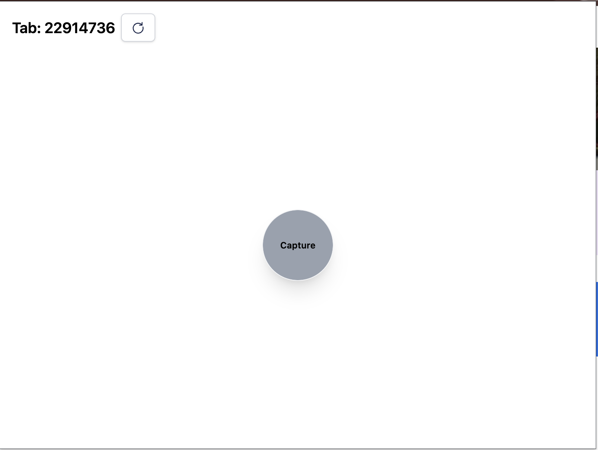
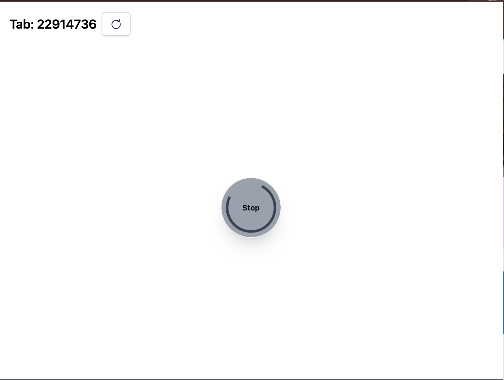
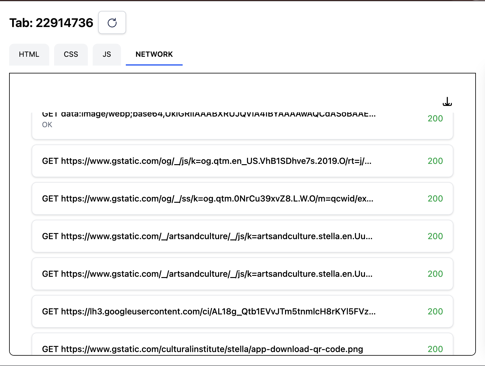
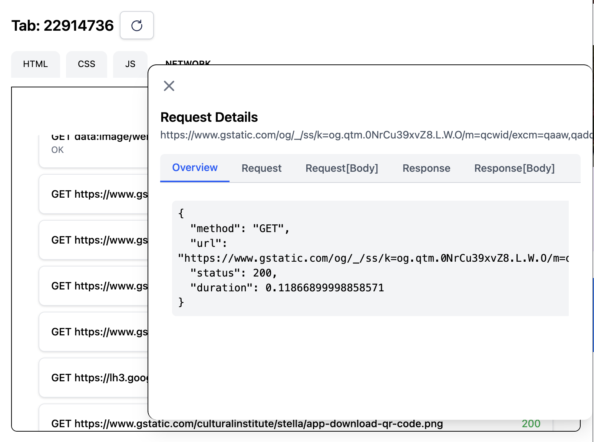

# Browser State

## Features Available
- Records Network calls happening between the Capture and Stop Action
- Records HTML, CSS , JS of the last page before Stop Action

### Demo

https://github.com/user-attachments/assets/565cb6f2-41b3-414a-a6fc-a1c6b06f3760

### Home Page

### Home on Action

### Home on Results

